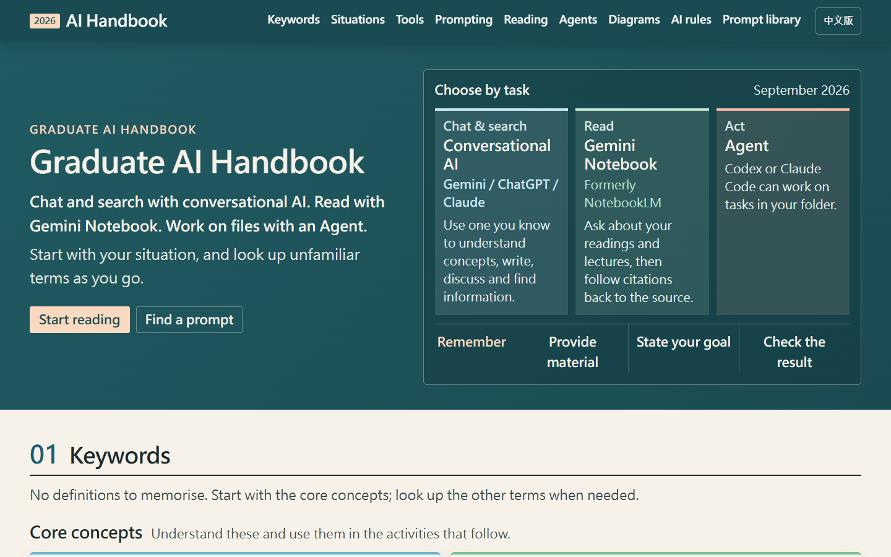
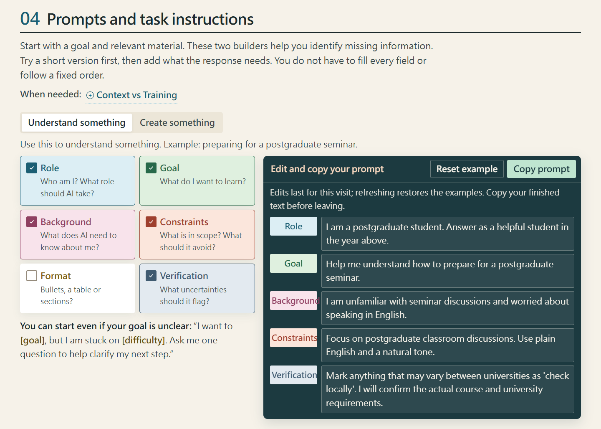
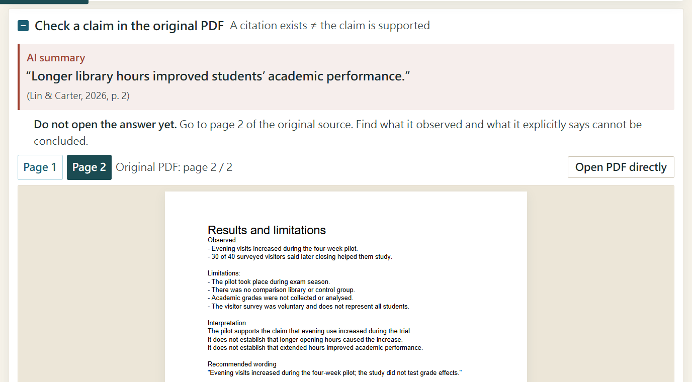
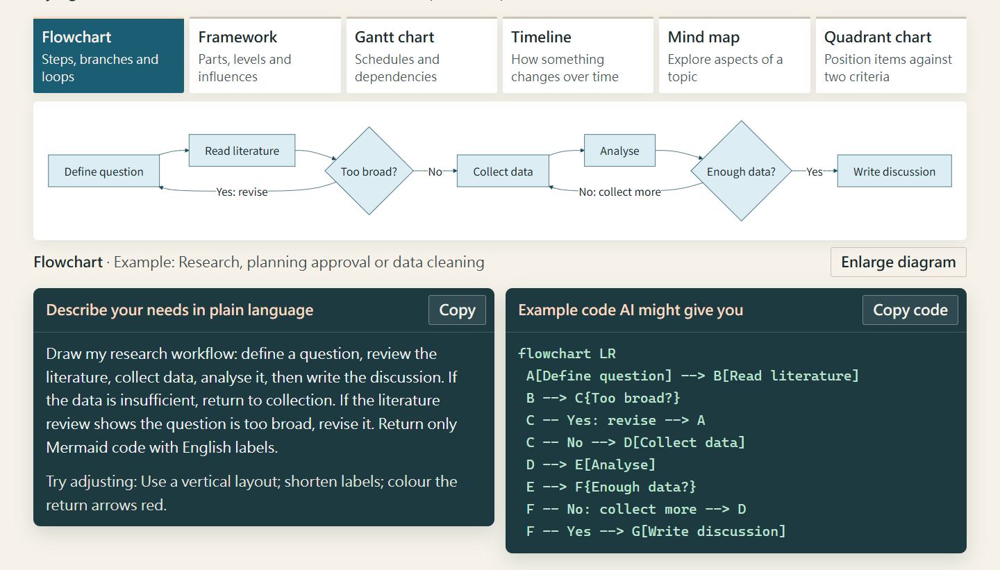
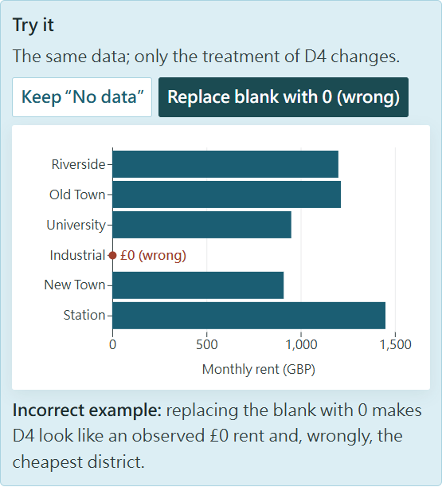
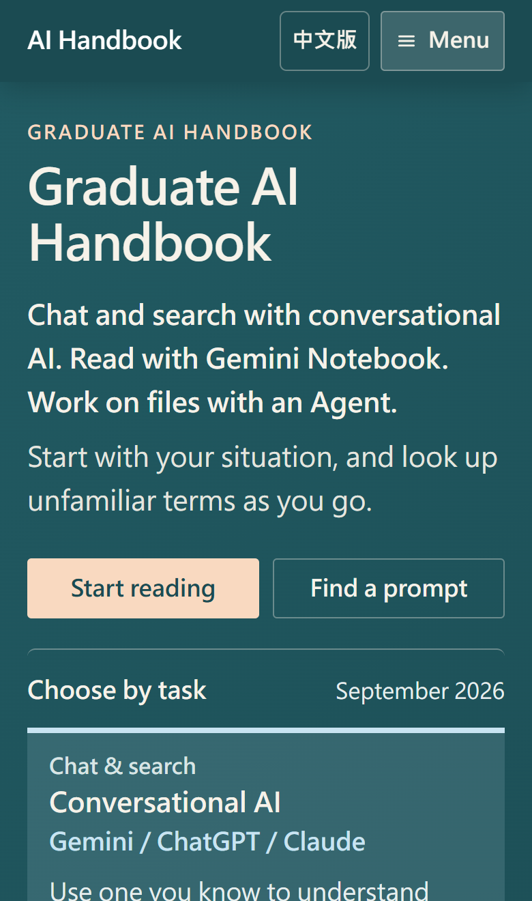

# ai-handbook

**New graduate students rarely lack prompts. What they lack is judgment: which kind of tool a task belongs to, what material to give it, and which outputs must be checked against the original source.**

[中文](README.md) · [Read online (English)](https://kuotunyu.github.io/ai-handbook/en.html) · [線上閱讀(中文)](https://kuotunyu.github.io/ai-handbook/)

[](https://github.com/kuotunyu/ai-handbook/actions/workflows/quality.yml)
[](https://github.com/kuotunyu/ai-handbook/actions/workflows/link-health.yml)


[](LICENSE)
[](LICENSE-CONTENT.md)

A single-page, bilingual (Traditional Chinese and English), zero-build handbook for graduate students without a technical background. It does not teach prompt incantations. It trains three habits that survive product changes: **choose the tool by task**, **supply the Context**, and **treat AI output as a lead, not as evidence**.

The site is plain HTML, CSS and JavaScript. Open `en.html` and it works offline; the libraries behind the interactive exercises live in this repository and load only when a reader opens an exercise. Every push runs Playwright, axe, contrast floors, translation completeness and asset budgets.



## Screens

| Prompt builder: add only what the response needs, edit, copy | Back to the original PDF: a citation is not support |
|---|---|
|  |  |

| Diagram chooser: six relationships, plain request and Mermaid code from one definition | Missing-value lab: the wrong way, filling a blank with 0 |
|---|---|
|  |  |

<div align="center">

| Phone (390px) |
|:---:|
|  |

</div>

## Learning design

- **Task before brand.** The opening gives one rule: chat and search with conversational AI, read with Gemini Notebook, work on files with an Agent. Products get renamed (NotebookLM became Gemini Notebook on 16 July 2026, and the handbook follows); kinds of work do not. Chapter 03 teaches readers to recognise whether AI is generating, searching, calculating or operating on files, each with its own check.
- **Think first, then expand.** Scenario checks, sample representativeness, unit conversion, missing values and citation exercises all ask for the reader's answer before the reasoning is shown. No scores, badges or gamification.
- **Deliberate traps for verification.** The fictional rent data for six districts mixes weekly and monthly rents and leaves one district blank ([`materials/en/districts.csv`](materials/en/districts.csv)). The fictional pilot report states that it did not establish better grades, yet the AI summary cites it for exactly that. The reader finds the contradiction on page 2.
- **Low cognitive load.** Four core concepts (Prompt, Context, hallucination, Agent); every other term sits in an extended vocabulary. Secondary reference material stays off the first-read path, and a test keeps it there.
- **Readability is a specification.** After the reader reported that light text was tiring, contrast floors for text colours on paper and white became CI checks: 7:1 for main text, 6.5:1 for secondary grey, at least 5.2:1 for accent colours.

## Contents

| Ch. | Topic | What the reader does |
|---|---|---|
| 01 | Keywords | Four core concepts and six extended terms; Token, Context and hallucination each have a short animation |
| 02 | Situations | Start from where they are stuck, then answer four think-first checks |
| 03 | Tools | Tell generation, search, calculation and operation apart, and how to check each |
| 04 | Prompting | Build a prompt from blocks, edit it, reset it, copy it |
| 05 | Reading | Read a fictional passage in Gemini Notebook, interpret a sampling animation, verify a citation in the original PDF |
| 06 | Agents | Hand off rent data with built-in traps, check the acceptance table, use the unit-conversion and missing-value labs |
| 07 | Diagrams | Six diagram types, one relationship each; plain request → Mermaid code → figure |
| 08 | AI rules | A five-step checklist for this year's university policy and a disclosure template |
| 09 | Prompt library | Ten editable examples that can be reset |

## Engineering

### Zero build, works offline

- Plain HTML/CSS/JavaScript with no framework and no backend; `index.html` and `en.html` open from `file://`. The PDF exercise needs http and falls back to a direct link to the file offline.
- D3, Observable Plot and PDF.js are vendored in [`vendor/`](vendor/) and loaded on demand; a Playwright test confirms none of them is requested on first page load.
- Ships a web app manifest and icons, so the site can be added to an iPhone home screen.

### Two languages, one codebase

- The English edition is not a second hand-written site. `en.html` and `app.en.js` are generated from the Chinese structure and interaction code plus an entry-by-entry translation catalogue (424 page entries, 132 interface strings). If Chinese source text changes without a matching translation, generation fails. Chinese punctuation left between links is converted, and CI rejects any Chinese character or punctuation that remains.
- The diagrams, practice data, result previews and all five animations have English versions. Switching language keeps the reader in the same chapter, with drafts kept separately per language.

### Reproducible media

- The six diagrams are pre-rendered to SVG from Mermaid definitions; the example code on the page and the figure come from the same definition.
- The five silent teaching animations are rendered with Manim Community from the same scripts in both languages, with the same layout. Rent figures and map geometry are read from the practice data in [`materials/`](materials/), never retyped.
- The fictional PDF is generated by [`scripts/generate-evidence-pdf.mjs`](scripts/generate-evidence-pdf.mjs). Citation.js formats its APA reference at build time and writes it into the page, so browsers never download Citation.js.

### Quality gates

Every push to `main` runs [`quality.yml`](.github/workflows/quality.yml):

| Check | What it covers |
|---|---|
| Playwright | 14 tests on desktop Chrome and a Pixel 7 profile: no console errors, chapter anchors, prompt builder, Agent walkthrough, PDF verification, both Plot labs, keyboard use of the phone menu, language switching that keeps the chapter and drafts, lazy loading of heavy libraries |
| axe-core | No critical accessibility violations |
| [static check](scripts/static-check.mjs) | Anchors and local file references, required sections, half-width brackets, text contrast floors, no Chinese characters or punctuation left in the English edition |
| [asset budget](scripts/asset-budget.mjs) | Size limits for core files and media (1.5 MiB per video, 15 MiB for `media/`); no autoplay or eager video preload |
| Vale | Product and technical term spelling (GeoJSON, Claude Code) |
| AutoCorrect | Spacing between Chinese and Latin text |
| generated check | The bibliography on the page matches Citation.js output |

A [weekly external link check](.github/workflows/link-health.yml) (lychee) catches official documentation and policy links that quietly break.

## Built with AI agents

The handbook is built the way it teaches. The author owns the learning decisions, the specification and acceptance; implementation is delegated to several AI coding agents (OpenAI Codex, Claude Code, ChatGPT); quality is held by executable rules rather than line-by-line manual review.

- **The collaboration contract is a file.** [`AGENTS.md`](AGENTS.md) sets the learning goals for every agent, the order of preference (cut first, clarify second, add features last), decisions that must not be reverted, and accessibility and media rules.
- **Feedback becomes a check.** Problems raised by the reader and the author (tiring light text, full-width brackets, Chinese punctuation left in the English edition) are enforced in CI, so the next agent cannot revert them without failing the build.
- **Agents do not overwrite each other.** Publishing first compares the remote head with the recorded base commit; if another agent has pushed in the meantime, publishing stops until the work is synced.
- **Accepted by testing, not by report.** Changes are exercised in a browser at desktop and phone sizes; [`LEARNING-AUDIT.md`](LEARNING-AUDIT.md) keeps a full learning-experience audit.

## Deliberately left out

- No quiz system, scores or gamification; active recall is reserved for judgments worth remembering.
- No model leaderboards, context-window numbers or subscription details; they age too quickly.
- No AI API calls; every demonstration is pre-written, and the practice happens in the reader's own tools.
- No framework or backend; if native HTML can do an interaction, no library is added.

## Repository layout

```text
index.html, en.html            Chinese page and the generated English page
app.js, app.en.js              Interaction code (one logic, strings per language)
diagrams.js, diagrams.en.js    Six diagram types with Mermaid code
styles.css, language.js        Layout, colour tokens and language switching
diagrams/  media/  materials/  Pre-rendered figures, animations and practice data (English in en/)
vendor/                        D3, Observable Plot, PDF.js (with their own licences)
scripts/                       Static check, asset budget, PDF and bibliography generation
tests/                         Playwright tests
.github/workflows/             Quality checks and the weekly link check
styles/Handbook/               Vale terminology rules
AGENTS.md                      Collaboration rules for AI agents
LEARNING-AUDIT.md              Learning-experience audit
```

## Run locally

```bash
# Read: open en.html directly; the PDF exercise needs http
python -m http.server 4173

# Full check (CI installs Vale and AutoCorrect separately)
npm install
npx playwright install chromium
npm run check
```

## Scope and limitations

- The practice data, the PDF and its citation are fictional teaching material, not real research.
- University AI rules are set by each institution each year; the policy link in the handbook only shows how to look one up.
- Product names and features were checked in September 2026.
- The phone layout was verified in Chromium and WebKit at 390px, 375px and landscape sizes, not yet fully on a physical iPhone.

## Licence

- Code (JavaScript, CSS, scripts, tests, workflows): [MIT](LICENSE)
- Teaching content (text, diagrams, animations, practice data and PDF): [CC BY 4.0](LICENSE-CONTENT.md)
- Third-party libraries in `vendor/` keep their own licences: D3 and Observable Plot are ISC, PDF.js is Apache-2.0
