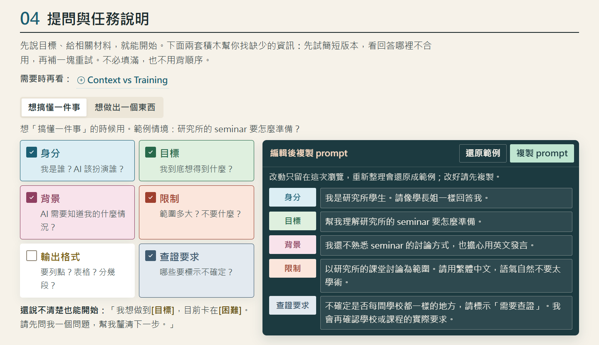
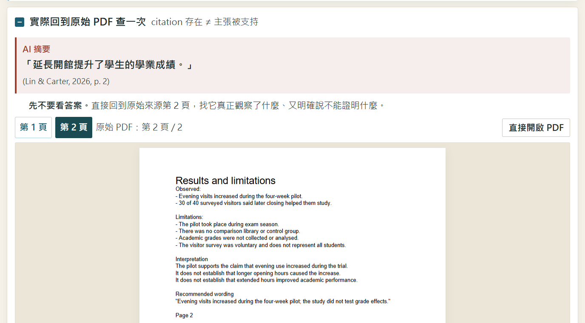
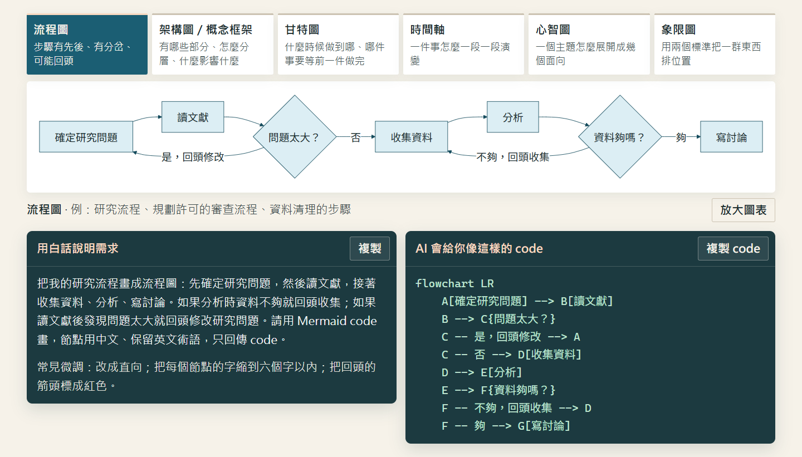
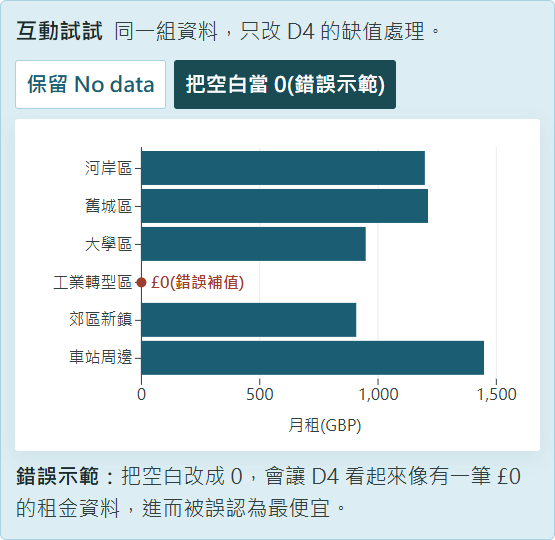
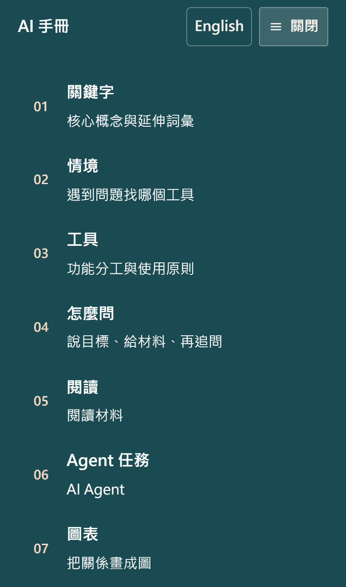

# ai-handbook

**研究所新生用 AI，缺的通常不是更多提示詞，而是判斷：這件事該交給哪種工具、要給它什麼材料、哪些輸出一定要回原文查證？**

[English](README.en.md) · [線上閱讀(中文)](https://kuotunyu.github.io/ai-handbook/) · [Read online (English)](https://kuotunyu.github.io/ai-handbook/en.html)

[](https://github.com/kuotunyu/ai-handbook/actions/workflows/quality.yml)
[](https://github.com/kuotunyu/ai-handbook/actions/workflows/link-health.yml)


[](LICENSE)
[](LICENSE-CONTENT.md)

一份單頁、中英雙語、零建置的 AI 使用手冊，對象是非技術背景、剛進研究所的學生。它不教咒語式的 prompt，而是把三個不會隨產品改版過時的判斷練成習慣：**依任務選工具**、**給足 Context**、**AI 的輸出不是證據**。

整站是純 HTML、CSS 與 JavaScript，雙擊 `index.html` 就能離線閱讀；互動練習用到的函式庫全部放在 repo 裡，只在讀者展開練習時才載入。每次推送都經過 Playwright、axe、對比度門檻、翻譯完整性與資產預算的檢查。


## 畫面

| 提問組裝器：按需要補上資訊，直接編輯後複製 | 回到原始 PDF：citation 存在 ≠ 主張被支持 |
|---|---|
|  |  |

**圖表選擇：六種關係各一個分頁，白話需求、Mermaid code 與圖出自同一份定義**



<div align="center">

| 缺值互動圖：把空白當 0 的錯誤示範 | 手機首頁(390px) | 手機目錄 |
|:---:|:---:|:---:|
|  |  |  |

</div>

## 教學設計

- **依任務，不依品牌。** 首屏只給一條規則：聊和查用對話型 AI、讀用 Gemini Notebook、動手用 Agent。產品會改名(NotebookLM 在 2026-07-16 改名為 Gemini Notebook，本站已同步)，任務型態不會。第 03 章教讀者辨認 AI 此刻是在生成、搜尋、計算還是操作檔案，每一種對應不同的檢查方式。
- **先判斷，再展開。** 情境題、樣本代表性、單位換算、缺值與引用練習都先要讀者自己回答，答案預設收起。沒有分數、徽章或遊戲化。
- **用刻意埋的陷阱練查證。** 虛構的六區租金資料混用週租與月租、其中一區缺值([`materials/districts.csv`](materials/districts.csv))；虛構的試辦報告 PDF 明寫「沒有證明成績提升」，AI 摘要卻這樣引用它。讀者要自己翻到第 2 頁找出矛盾。
- **壓低認知負荷。** 核心概念只有四個(Prompt、Context、幻覺、Agent)，其餘詞彙收在延伸區；次要參考資料不擋在第一次閱讀的路徑上，並有測試守住。
- **可讀性是規格，不是感覺。** 讀者反映淺色字讀起來吃力之後，文字色對紙面與白底的對比度下限寫進 CI(主要文字 7:1、次要灰 6.5:1、強調色至少 5.2:1)。

## 內容

| 章 | 主題 | 讀者會做的事 |
|---|---|---|
| 01 | 關鍵字 | 四個核心概念與六個延伸詞彙；Token、Context、幻覺各有一段短動畫 |
| 02 | 使用情境 | 從自己卡住的地方找入口，再做四題「先判斷，再展開」 |
| 03 | 工具與功能 | 先拆開 AI 工具的三層(介面、Harness、模型)，再分辨生成、搜尋、計算、操作與各自怎麼檢查 |
| 04 | 提問與任務說明 | 用兩套積木組出 prompt，直接編輯、還原、複製 |
| 05 | 文獻閱讀與查證 | 在 Gemini Notebook 讀一篇虛構短文、判讀樣本動畫、回原始 PDF 查證引用 |
| 06 | Agent 任務執行 | 認識各家的五種形態(模型、網頁版、桌面版、IDE 版、指令版，每格附介面示意圖)；交辦一份含陷阱的租金資料，對照驗收表，操作單位換算與缺值兩個互動圖 |
| 07 | 圖表選擇與製作 | 六種圖各對應一種關係；白話需求 → Mermaid code → 圖 |
| 08 | AI 使用規範 | 查學校當年度政策的五步清單與申報模板 |
| 09 | 提示詞範例 | 十個可編輯、可還原的範例 |

## 工程

### 零建置、可離線

- 純 HTML/CSS/JavaScript，不用框架、不需後端；`index.html` 與 `en.html` 以 `file://` 開啟即可閱讀。PDF 查證練習需要 http，離線時退回直接開檔的連結。
- D3、Observable Plot、PDF.js 放在 [`vendor/`](vendor/)，只在展開對應練習時動態載入；Playwright 測試確認首頁載入時一個都沒有被請求。
- 附 Web App Manifest 與圖示，iPhone 可加入主畫面。

### 兩種語言，一套程式

- 英文版不是另一份手寫網頁：`en.html` 與 `app.en.js` 由中文版的結構與互動程式，加上逐條翻譯目錄產生(464 個頁面條目、132 個互動字串)。中文來源改了而翻譯沒跟上時，產生步驟直接失敗；夾在連結之間的中文標點會換成英文標點，CI 也會擋下殘留的中文字與標點。
- 六張圖、練習資料、成果預覽與五段動畫都有英文版。切換語言時停在同一章，兩種語言的編輯草稿分開保存。

### 可重現的媒體

- 六種圖表由 Mermaid 定義預先繪製成 SVG，頁面上的範例 code 與圖出自同一份定義。
- 五段無聲教學動畫以 Manim Community 繪製，中英兩版同一支腳本、同一個版面；判讀動畫裡的租金數字與地圖幾何直接讀自 [`materials/`](materials/) 的練習資料，不手動抄寫。
- 虛構 PDF 由 [`scripts/generate-evidence-pdf.mjs`](scripts/generate-evidence-pdf.mjs) 產生；參考文獻由 Citation.js 在建置時排成 APA 寫回頁面，瀏覽器不必下載 Citation.js。

### 品質閘門

每次推送到 `main` 都會執行 [`quality.yml`](.github/workflows/quality.yml)：

| 檢查 | 內容 |
|---|---|
| Playwright | 14 個測試，在桌面 Chrome 與手機 Pixel 7 兩種裝置設定下執行：無 console error、章節錨點、提問組裝器、Agent 步驟示範、PDF 查證、兩個 Plot 練習、手機選單鍵盤操作、語言切換保留章節與草稿、重型函式庫延遲載入 |
| axe-core | 不允許 critical 等級的無障礙問題 |
| [static check](scripts/static-check.mjs) | 錨點與本地檔案引用、必要章節、全站半形括號、文字色對比度下限、英文版不得殘留中文字或中文標點 |
| [asset budget](scripts/asset-budget.mjs) | 核心檔案與媒體大小上限(單支影片 1.5 MiB、media 資料夾 15 MiB)，影片不得自動播放或預先下載 |
| Vale | 產品與技術術語拼寫(例如 GeoJSON、Claude Code) |
| AutoCorrect | 中英文之間的間距 |
| generated check | 頁面上的參考文獻與 Citation.js 輸出一致 |

另有[每週一次的外部連結檢查](.github/workflows/link-health.yml)(lychee)，避免官方文件與政策連結悄悄失效。

## 與 AI agent 協作開發

這份手冊教的事，也是它被做出來的方式：教學取捨、規格與驗收由作者決定，實作交給多個 AI coding agent(OpenAI Codex、Claude Code、ChatGPT)，品質則交給可執行的規則，而不是逐行人工檢查。

- **協作契約寫成檔案。** [`AGENTS.md`](AGENTS.md) 規定所有 agent 的教學目標、取捨順序(先刪減、再澄清、最後才加功能)、不能被改回去的決定，以及無障礙與媒體規則。
- **回饋變成檢查。** 讀者與作者指出過的問題(淺色字吃力、全形括號、英文版殘留中文標點)都寫進 CI；下一個 agent 無法在不讓 CI 失敗的情況下改回去。
- **多個 agent 不互相覆蓋。** 發布流程先比對遠端的基準提交；如果別的 agent 已經推上新提交，發布會停下，先同步再繼續。
- **以實測驗收，不以回報驗收。** 改動要在瀏覽器裡以桌面與手機尺寸實際操作過；[`LEARNING-AUDIT.md`](LEARNING-AUDIT.md) 保留一次完整的學習體驗稽核。

## 刻意不做的事

- 不做測驗系統、分數或遊戲化；主動回想只用在值得記住的判斷上。
- 不追模型排行、context window 數字或訂閱方案細節，這些資訊過時得太快。
- 不呼叫任何 AI API；所有示範都是預先寫好的，實作要到讀者自己的工具裡完成。
- 不引入框架或後端；能用原生 HTML 做到的互動，就不加函式庫。

## 專案結構

```text
index.html, en.html            中文頁面與產生出的英文頁面
app.js, app.en.js              互動程式(同一份邏輯，字串分語言)
diagrams.js, diagrams.en.js    六種圖表的說明與 Mermaid code
styles.css, language.js        版面、配色 token 與語言切換
diagrams/  media/  materials/  預先繪製的圖、動畫與練習資料(英文版在各自的 en/)
vendor/                        D3、Observable Plot、PDF.js(保留各自授權)
scripts/                       靜態檢查、資產預算、PDF 與參考文獻產生
tests/                         Playwright 測試
.github/workflows/             品質檢查與每週連結檢查
styles/Handbook/               Vale 術語規則
AGENTS.md                      給 AI agent 的協作規範
LEARNING-AUDIT.md              學習體驗稽核
```

## 本機執行

```bash
# 閱讀：直接開 index.html；PDF 查證練習需要 http
python -m http.server 4173

# 完整檢查(Vale 與 AutoCorrect 在 CI 另外安裝)
npm install
npx playwright install chromium
npm run check
```

## 範圍與限制

- 練習資料、PDF 與其中的引用都是虛構教學材料，不是真實研究。
- 學校的 AI 規範以各校當年度公告為準；手冊裡的政策連結只是查詢方式的範例。
- 產品名稱與功能查核於 2026 年 9 月。
- 手機版以 390px、375px 與橫向尺寸在 Chromium 與 WebKit 模擬驗證，尚未在 iOS Safari 實機完整測試。

## 授權

- 程式碼(JavaScript、CSS、scripts、tests、workflows)：[MIT](LICENSE)
- 教材內容(文字、圖表、動畫、練習資料與 PDF)：[CC BY 4.0](LICENSE-CONTENT.md)
- `vendor/` 內的第三方函式庫依各自授權：D3 與 Observable Plot 為 ISC，PDF.js 為 Apache-2.0
